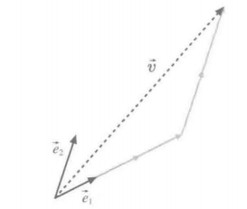

# 1.1 向量与空间

## 1.1.1 最直接的定义：把数值罗列起来就是向量

在给定数 $c$ 、$c\prime$及向量 $\vec{x}$ 、$\vec{y}$的情况下，我们可以看到下面这些性质。

* $(cc\prime)\vec{x}=c(c\prime\vec{x})$
* $1\vec{x}=\vec{x}$
* $\vec{x}+\vec{y}=\vec{y}+\vec{x}$
* $(\vec{x}+\vec{y})+\vec{z}=\vec{x}+(\vec{y}+\vec{z})$
* $\vec{x}+\vec{o}=\vec{x}$
* $\vec{x}+-\vec{x}=\vec{o}$
* $c(\vec{x}+\vec{y})=c\vec{x}+c\vec{y}$
* $(c+c\prime)\vec{x}=c\vec{x}+c\prime\vec{x}$

这么显然的事情，干嘛还要专门罗列出来呢？

这里列举的性质，实际上代表了向量这个概念的本质。后面关于向量的讨论全部基于上面这些性质。最厉害的地方在于，即使将向量的定义（现阶段的定义是“排成一列的数”）抛在脑后，仅仅是依靠上面给出的性质，我们一样可完成所有关于向量的讨论！

## 1.1.2 "空间"的形象

强调向量的位置的时候，称为位置向量。

可以用有向线段来解释，其中线段的起点是原点O , 终点是该向量对应的位置。

其实，在用有向线段来解释向量的情况下，就可以通过图形来理解向量的加法和数量乘法。

向量加法就变成了线段的连接，数量乘法则变成了线段的伸缩。

把一维向量 $(a)$ 和数 $a$ 看作同一个东西也是很自然的想法，因为两者都可以表示为直线上的一点。但是要注意的是，根据单位的选取方式的不同，数值也是会变化的。这正是我们下一小节要讲的“基底”的问题。

在大部分程序设计语言中，长度为 1 的数组和单个数值也是两回事，在处理的时候也需要专门进行转换。

## 1.1.3 基底

### 宇宙中没有上下左右

没有刻度，也没有特定的方向，我们得到了一张干干净净的平面。能作为参照的，仅剩孤零零的一个原点 $O$ 。虽然一开始会感到一丝不安，但是我们会发现，在这样的世界中一切都是可行的。也就是说，加法和数量乘法，依旧可以用有向线段来解释。那些可有可无的东 西，去掉才是更明智的选择。对于这样一个附加了加法与数量乘法运算的世界，我们就称之为线性空间，也有人称之为向量空间。

在这样一个世界中，由于更加强调方向性，因此我们用 $\vec{x}、\vec{v}、\vec{e}$ 来表示向量。

将向量看作是并排的数时，用 $x$ 来表示；当我们希望强调方向时,则将向量看作有向线段，用 $\vec{x}$ 来表示。

线性空间是我们生活的现实空间的一个缩影，是对现实空间的抽象化。正因为不是现实 世界的完全复制，所以不能照搬生活经验。

在这个抽象世界中，除了特殊的零向量以外，有向线段无论放在哪里都是同等的。在这个抽象世界中，我们能做的只有加法、数量乘法，一切都是这么简单直接。

***

如果保留方格纸的刻度的话，对于向量x = {x^x2）t.我们可以用 $\sqrt{x_1^2+x_2^2}$ 求其长度。把刻度去掉之后，不是变得不便了吗？

>如此这般的话，你就不知不觉地回到了现实世界，这正是刻度带来的直接危害。而线性空间只要求给出加法和数量乘法的定义，并满足 1.1.1 节中列举的性质。实际上，在这种朴素的定义下，有一个问题是，数值会根据坐标系的选取方式（将会在后面说明）而发生变化。关于这个问题的应对办法，请参考附录E。

### 选定基准，赋予地址

建立一种 不需要动用手指也能顺利沟通的方式，那就是给线性空间的世界编写地址。

首先我们要确定用什么来作为基准，比如图中的向量 $\vec{e_1}$ 和 $\vec{e_2}$ 。

在选好基准之后，我们就可以通过“沿着 $\vec{e_1}$ 走3步，再沿着 $\vec{e_2}$ 走2步”来指定向量 $\vec{v}$ 的位置。

换句话说就是：

$$\vec{v} = 3\vec{e_1} + 2\vec{e_2}$$

这里作为基准的一组向量就叫作 **基底** ，沿着各个基准向量走的步数叫作坐标。拿上一个例子来说，就是在基底 $(\vec{e_1},\vec{e_2})$ 下， $v$ 的坐标为 $v = (3,2)^T$。另外，说到基底，指的便是 $(\vec{e_1},\vec{e_2})$ 这一组向量，这一组向量中的成员 $\vec{e_1}$、$\vec{e_2}$ 就称为 **基向量** 。

但是，并不是说随便取几个向量放在一起就能叫作基底。在下一小节中，我们将讨论什么样的一组向量才有资格成为基底。

## 1.1.4 构成基底的条件

只有当以下两个条件同时满足时，一组向量 $(\vec{e_1},\cdots,\vec{e_n})$ 才能称为基底。

1. （当前空间中的）任何向量 $\vec{v}$ 都可以写成
$$\vec{v} = x_1\vec{e_1} + \cdots + x_n\vec{e_n}$$
2. 并且这种表示方法是唯一的。

条件 1 显然是先决条件。既然我们要采用坐标的语言进行沟通，如果存在无法用坐标表示的东西那就糟了。

条件 2 也一样，为了避免多余的麻烦，也是必要的。否则，当我们看到两个不同的坐标 $x = (x_1, \cdots ,x_n)^T$ 和 $y = (y_1,\cdots ,y_n)$ 时，就会不清楚它们对应的实体 $x$ 和 $y$ 到底是不是同一个，还是同一个东西采用了两种不同的写法。

把条件 2 掰碎嚼烂讲就是

如果
$$(x_1, \cdots, x_n)^T \neq (x_1\prime, \cdots, x_n\prime)$$
则
$$x_1\vec{e_1} + \cdots + x_n\vec{e_n} \neq x_1\prime\vec{e_1} + \cdots + x_n\prime\vec{e_n}$$

或者写成上面式子的逆否命题。

如果
$$x_1\vec{e_1} + \cdots + x_n\vec{e_n} = x_1\prime\vec{e_1} + \cdots + x_n\prime\vec{e_n}$$
则
$$(x_1, \cdots, x_n)^T = (x_1\prime, \cdots, x_n\prime)$$

一般的教科书会对上面的式子进行整理，如下
$$v_1\vec{e_1} + \cdots + v_n\vec{e_n} = \vec{o}$$
则
$$v_1 = \cdots = v_n = 0$$

满足以上两个条件时，$\vec{e_1}, \cdots \vec{e_n}$ 就称为线性无关。

对于给定的向量 $e_1, \cdots, e_n$，我们将可以用数 $v_1, \cdots,v_n$ 表示出来的向量 $v_1\vec{e_1} + \cdots + v_n\vec{e_n}$ 称为 $\vec{e_1},\cdots,\vec{e_n}$ 的线性组合。有了线性组合的概念之后，我们就可以说：若任意向量 $\vec{x}$ 都可以用 $\vec{e_1},\cdots,\vec{e_n}$ 的线性组合来表示，且表示方法唯一，则$(\vec{e_1},\cdots,\vec{e_n})$称为基底。

## 1.1.5 维数

发现 n 维空间中基向量的个数恰好是n。其实严格来讲，应该是反过来通过基向量的个数来定义空间的 **维数**。

$$维数 = 基向量的个数 = 坐标的分量数$$

存在无限维的情况，但是无限维时，有些特性与有限维有很大差别，所以不讨论。

我们只讨论有限维的情况。

## 1.1.6 坐标

在不指定基底的情况下，讨论坐标根本没有意义。

对于向量 $\vec{x}$、$\vec{y}$ 以及数 $c$ ,可以确认有

$$\vec{x} + \vec{y} = (x_1 + x_2)\vec{e_1} + \cdots + (x_n + y_n)\vec{e_n}$$

$$c\vec{x} = (cx_1)\vec{e_1} + \cdots + (cx_n)\vec{e_n}$$

如果有同时出现两组以上的基底的情况。这时候当然要明确正在使用的是哪一组基底。有两组基底的情况下，会出现根据一组基底对应的坐标求另一组基底对应的坐标的“坐标变换”问题。
